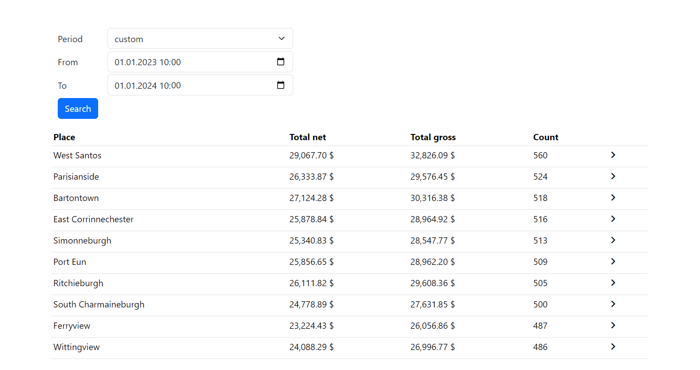

# bi example

# Tech stack:
**Backend:**
- JDK 15+
- Spring 3.2.1
- Lombok 1.8.3
- JUNIT 1.19.3
- Elasticsearch 8.11.3
- Docker
  
**Frontend:**
- Path: /bi-ui 
- Angular 17
- Bootstrap 5.x
- Material Icons

Swagger
http://localhost:8080/swagger-ui/index.html#/company-controller/getAllSales

# Start backend:
- build gradle
- docker-compose up -d 
- Start SkytabbiApplication

# Start gui: 
- cd /bi-ui 
- npm install @angular/cli
- npm install
- ng serve

# Start integration tests
./gradlew clean build

# License
[MIT](https://github.com/bfwg/angular-spring-starter/blob/master/LICENSE)